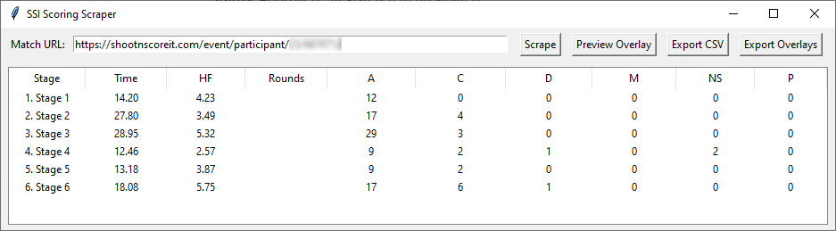
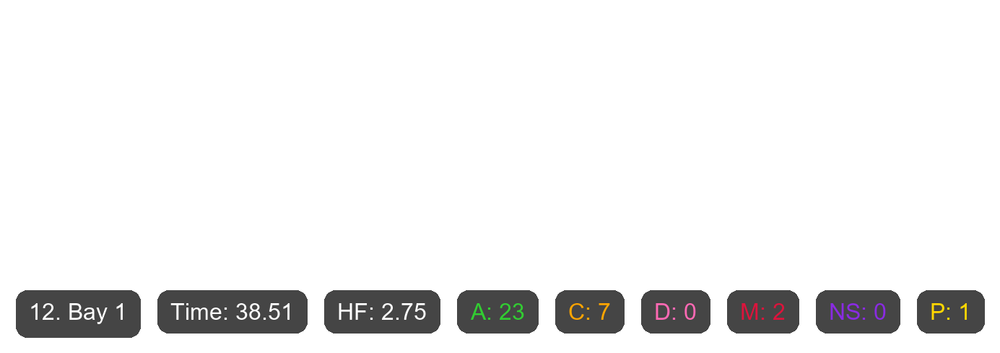

Hi there fellow competition shooter!

## What the hell is this?

This is an AI-prompt generated application that scrapes the IPSC scoring site [shootnscoreit.com](https://shootnscoreit.com) for your match results and then generates overlay images that can be used when editing your match footage. 
No more, no less.

## Screenshots
Main window

Generated overlay for a sample stage

Do note the padding added on the top of the overlay image. The added 400 pixels of transparent nothing is to cirvumvent some issues/limitations in DaVinci Resolve, my video editor of choice. This can be changed in the code if you don't want it.

## Why?
This application was heavily inspired by the user Andreas_IPSC on youtube where he mentions in one of his videos that he created an application that does the exact same thing. At the time of creating this he mentions in one of his videos that he has no current intention to release his application to the wild. So I thought I'd fire up a AI-code generator and have a go at it myself. 
Why? Because I'm a fellow competition shooter too and editing in scores without a tool like this makes the editing process an even bigger pain in the ass than it already is and it's gotten to a point where I don't even release videos anymore due to this. 
Time stamped link to Andreas' video where he mentions his tool: https://youtu.be/AoIqM-fI8ag?t=629. You will clearly see the resemblance in funtionality.

## How do I use it?
The application is pretty self explanatory once it's started but you will need to edit the configuration file config.json to get it working. 
Unpack the contents of the zip file in a directory of your choice.   
Before using it, please read the sections below [Support? Issues?](https://github.com/TheBamse/SSI-Scoring-Overlay-Software/edit/main/README.md#support-issues) and [Security considerations](https://github.com/TheBamse/SSI-Scoring-Overlay-Software/edit/main/README.md#support-issues). Use this software on your own risk! I take no responsibilitys for anything, but I can't really see anything bad with it except for whats mentiond under the Security considerations :P  

The application is pretty self explanatory once it's started but you will need to edit a configuration file to get it working. 
As mentioned, the software scrapes your personal result page for a match and temporarily stores them in the application. Your personal result page does however not include the Rounds to be scored on that stage so if you want those included in the overlay you have the option to edit the scraped results before generating the overlay images. The edit function can also be handy if the scraped results are incorrect.  
Along with the main executable is a config.json-file. The application will start without any edits but for the scraping to work you will at minimum need to edit in your SSI login and password.

#### Additional settings
If you want to change the font in the overlays, specify the path to the font file in the "font_path" setting. 
All overlay images will be created in a subfolder called "overlays" wherever you unpacked the zip and if you wna to change that directory name, change the "output_dir" setting to something else. 
"last_match_url" and "window_geometry" aren't meant to be changed by the user, it's used by the software to provide some quaily of life; the application remembers the last entered match URL and window size and location. 
Debug mode is currently removed from the software,m do not enable it or scraping will not work :)

## Support? Issues?
I have no coding experience what so ever. I just fired up an AI-tool and described to it what I wanted. If the application stops working or featurtes are missing ... well, don't expect too much is what I'm saying. I'm not actively supporting or updating the application at all.  
This repo holds the most current version of the source code for the application if you want to check it out or do something like this on your own. Feel free to copy, do modifications or whatever you like. I would appreciate some kind of feedback if you do modify or share this someftware with someone else though. 
I'm mostly publishing the source code to prove I'm not I'm not collecting your SSI login information or anything like that.

## Security considerations
As mentioned above; this application will store your SSI login and password in clear text. If someone gets hold of this file you login information is, ofcourse, compomized. 
It's on **YOU** to store this information in a safe manner.
