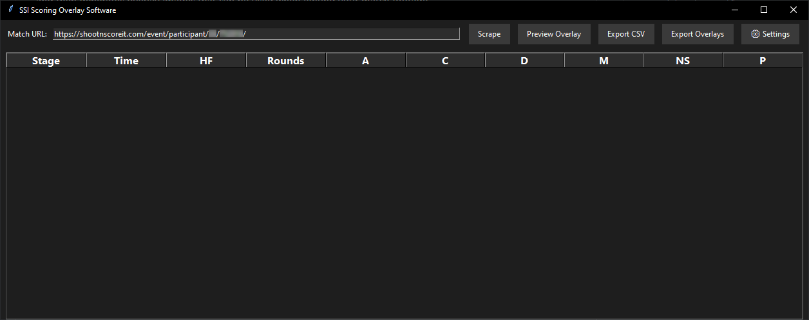
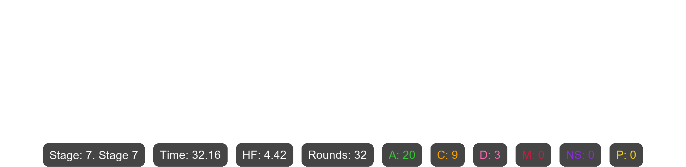

Hi there fellow competition shooter!

## Lastest updates
Just completed version 2.5 of the software. Not much new functionality was added but here's a changelog:

### New features:
* Add the option to edit the application config from within the application. If no config.json is present, create one using some defaults and prompts for login details for SSI
* Make colors customizable
* Add button to reset to defaults.

#### Improvements:
* Right after scraping, if no stage is selected when clicking "Preview Overlay" an error was displayed saying "Select a stage first". Now it previews the first/top stage automatically.
* When editing a cell, you previously had to select the previous value, now it selects it so you can change or edit it right away.

#### Minor whoopsies:
* Accidentally called this release 3.0 on in some commits. No, 3.0 will not be released yet. 3.0 will be a GUI-update or rewrite, no other new features or fixes planned as of yet tho ;)

## What the hell is this?

This is an AI-prompt generated application that scrapes the IPSC scoring site [shootnscoreit.com](https://shootnscoreit.com) for your match results and then generates overlay images that can be used when editing your match footage. 
No more, no less.

## Screenshots
Main window (updated for version 2.5!)

Generated overlay for a sample stage

Do note the padding added on the top of the overlay image. The added 400 pixels of transparent nothing is to cirvumvent some issues/limitations in DaVinci Resolve, my video editor of choice. This can be changed in the code if you don't want it.

## Why?
This application was heavily inspired by the user Andreas_IPSC on youtube where he mentions in one of his videos that he created an application that does the exact same thing. At the time of creating this he mentions in one of his videos that he has no current intention to release his application to the wild. So I thought I'd fire up a AI-code generator and have a go at it myself. 
Why? Because I'm a fellow competition shooter too and editing in scores without a tool like this makes the editing process an even bigger pain in the ass than it already is and it's gotten to a point where I don't even release videos anymore due to this. 
Time stamped link to Andreas' video where he mentions his tool: https://youtu.be/AoIqM-fI8ag?t=629. You will clearly see the resemblance in funtionality.

## How do I use it?
The application is pretty self explanatory once it's started, check it out and feel free to post an issue and ask help if you need it! :)  
Unpack the contents of the zip file in a directory of your choice.   
Before using it, please read the sections below [Support? Issues?](https://github.com/TheBamse/SSI-Scoring-Overlay-Software?tab=readme-ov-file#support-issues) and [Security considerations](https://github.com/TheBamse/SSI-Scoring-Overlay-Software?tab=readme-ov-file#security-considerations---please-read). 
Use this software on your own risk! I take no responsibility for anything, but I can't really see anything bad with it except for whats mentiond under the Security considerations :P  

As mentioned, the software scrapes your personal result page for a match and temporarily stores them in the application. Your personal result page does however not include the Rounds to be scored on any stage at the time of writing this, so if you want those included in the overlay you have the option to edit the scraped results before generating the overlay images. The edit function can also be handy if the scraped results are incorrect somehow. 
Double click a cell to edit its contents.  
On the first start of this application some preset defaults will apply and you will be prompted to enter your SSI login and password. For the scraping to work you will need to enter those, no ways around it. 
Hit the Settings button to make changes to what font is used (might break the overlay layout? :P), colors on the different pill texts, background and outline. Try it out! :)

#### Additional settings
All overlay images will be created in a subfolder called "overlays" wherever you unpacked the zip, if you want to change this then hit the Settings button. 
Debug mode is currently removed from the software, do not enable it or scraping will not work :) 
Feel free to manually edit your config.json file but not sure why you'd want to. If you screw anything up, just delete the file and start the application again, a new fresh default config.json will be created.

## Support? Issues?
I have no coding experience what so ever. I just fired up an AI-tool and described to it what I wanted. If the application stops working or features are missing ... well, don't expect too much is what I'm saying. I'm not actively supporting or updating the application at all. I will however update it and add new functionality when I feel like it. Feel free to leave a suggestion [here](https://github.com/TheBamse/SSI-Scoring-Overlay-Software/issues). Make sure to use the tag  $\color{Green}{\textsf{"suggestion"}}$.  
This repo holds the most current version of the source code for the application if you want to check it out or do something like this on your own. Feel free to copy, do modifications or whatever you like. I would appreciate some kind of feedback if you do modify or share this someftware with someone else though. 
I'm mostly publishing the source code to prove I'm not I'm not collecting your SSI login information or anything like that.  
If you have any suggested improvements you've made to your own fork or local copy, please make a pull request and lets make the application better together! <3

## Security considerations - PLEASE READ
As mentioned above; this application **will** store your SSI login and password in clear text in the config.json file in the same directory as the application. If someone gets hold of this file you login information is, of course, compromized. 
It's on **YOU** to store this information in a safe manner.
